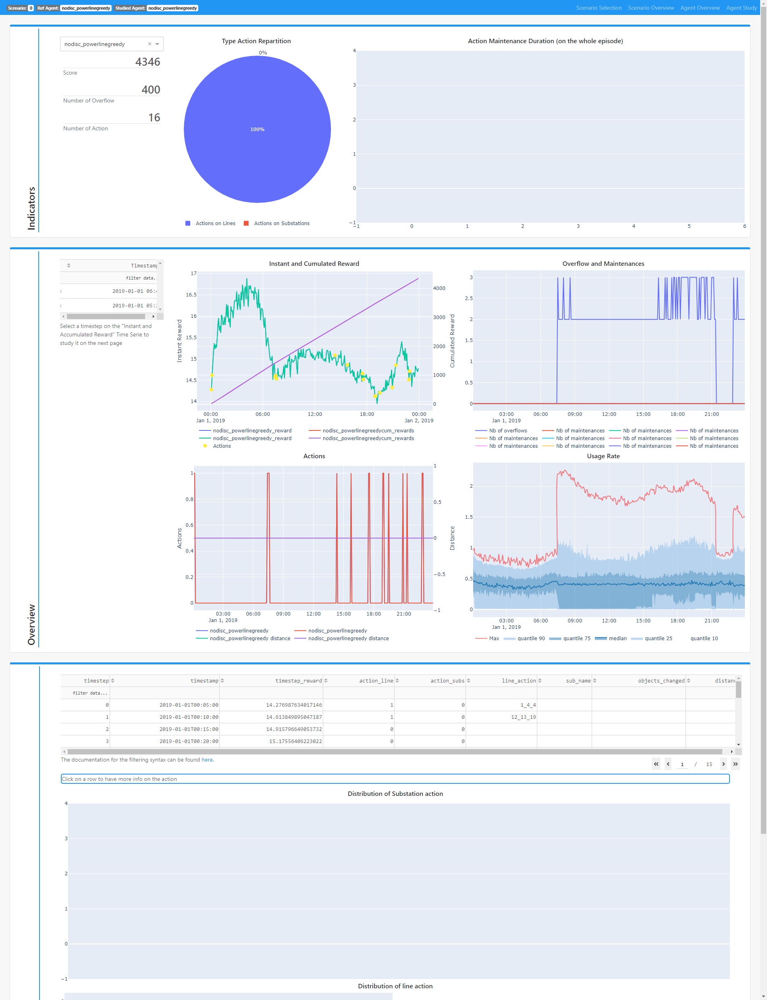
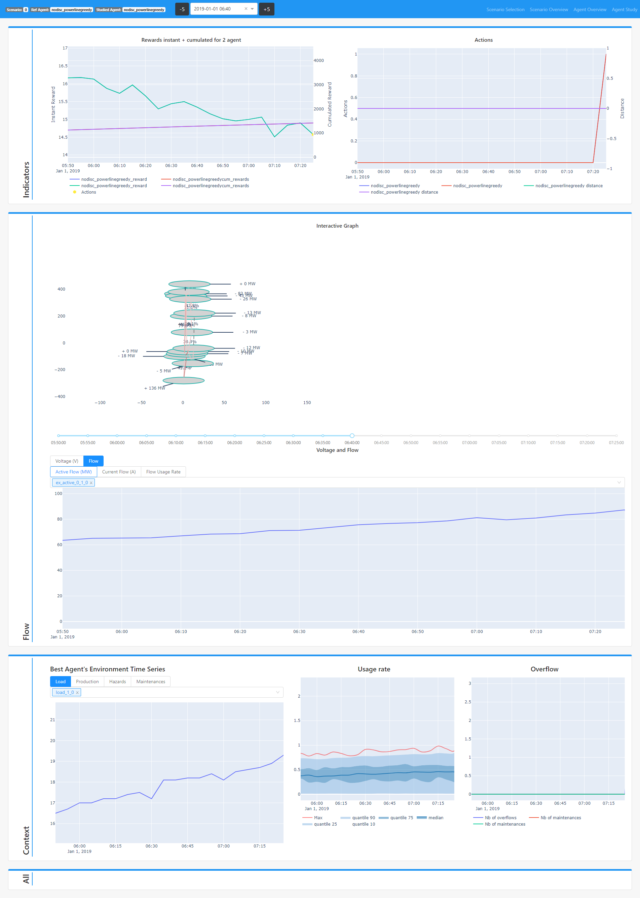

# Grid2Viz

Grid2Viz is a web application that offers several interactive views into the results of Reinforcement Learning agents that ran on the [Grid2Op](https://github.com/rte-france/Grid2Op) platform.

*   [1 Installation](#installation)
*   [2 Run the application](#run-the-application)
*   [3 Getting Started](#getting-started)
*   [4 Caching](#caching)

## Installation
### Requirements:
*   Python >= 3.6

### Instructions

#### Step 1: Install Python3
On Debian-like systems (Ubuntu):
```commandline
sudo apt-get install python3
```

On Fedora-like systems:
```commandline
sudo dnf install python3
```

If you have any trouble with this step, please refer to
[the official webpage of Python](https://www.python.org/downloads/release/python-366/).

#### Step 2: Clone Grid2Viz
```commandline
git clone https://github.com/mjothy/Grid2Viz.git
```

This should create a folder Grid2Viz with the current sources.
#### (Optional, recommended) Step 2bis: Create a virtual environment
```commandline
pip3 install -U virtualenv
cd Grid2Viz
python3 -m virtualenv venv_grid2viz
```

#### Step 3: Run the installation script of Grid2Viz
Finally, run the following Python command to install the Grid2Viz necessary Python depencies:
```commandline
cd Grid2Viz/
source venv_grid2viz/bin/activate
pip install -U -r requirements.txt
```

## Run the application
Tu run the Grid2Viz application, run the foolowing command:
```commandline
cd Grid2Viz/
source venv_grid2viz/bin/activate
python launch_grid2viz.py
```
> **_WARNING_** Due to the caching operation the first run can take a while. All the agents present in the configuration files
will be computed and then registered in cache. Depending on your agents it could take between 5 to 15min. You can follow the progress in the console.

## Getting started

In order to use this tool, you need to have serialized the RL process of grid2op. The expected file system is :
- root_dir
    - agent_1
        - scenario_1
        - scenario_2
    - agent_2
        - scenario_1
        - scenario_2
        - scenario_3

Each of the scenario_* files have to contain all files given by serialisation of your RL through grid2op.
In order to add a new agent to the app, you will have to add the agent's folder to this root_dir
For the update process of this folder chain, see the section `Caching` (in particular, when you want to overwrite the current
agents in root_dir with new versions with the same names)

In the config.ini of this repo:
 - change the `base_dir` option to your root_dir of data.
 - change the `env_conf_folder` option to the directory that contains the following file :
    - coords.csv : The csv file that lists the coordinates of nodes in the network

Changing this config.ini file will require a restart of the server to update.

Grid2Viz provide 2 agents with a scenario for one day and for one month available in data/agent folder:

- nodisc_powerlinegreedy
- withdisc_deter

By default the config.ini is targeting these agents as well as the environment configuration folders.

##  Caching

The cache system allows you to only compute long calculations of the app once per agent/scenario.
The app will create a folder `_cache` in the `base_dir` of the config.ini which will contain these long calculations serialized.

If you add a new folder in your `base_dir` (either an agent, or a scenario) you will have to restart the server so the app
reads the folder tree again.

**_WARNING_** : If you overwrite the agents while they were already cached, you will have to manually reset the cache so the app
knows to compute everything again with the updated data. To do so, you just need to delete the `_cache` folder.

## Interface
#### Scenario Selection
This page display up to 15 scenarios with for each one a brief summary using the best agent's performances.

 


#### Scenario Overview
On this page are displayed the best agent's kpi to see his performances. It's also here that you can select an agent that will
be used as reference agent in the other pages to compare to the studied agents.


#### Agent Overview
Here's displayed your reference agent's performances. You can select an agent to study to compare it with your reference via the
dropdown on the page. The study agent selected will be used as study agent on the last page.

In the *"instant and cumulated reward"* graph you can point timestep that will be use in the next page to study 
action in a specific timestep area.




#### Agent Study
The Agent Study page will display kpi of your reference agent compared to your study agent on your selected timestep area.
You will also see a summary of the previous page's kpi.


