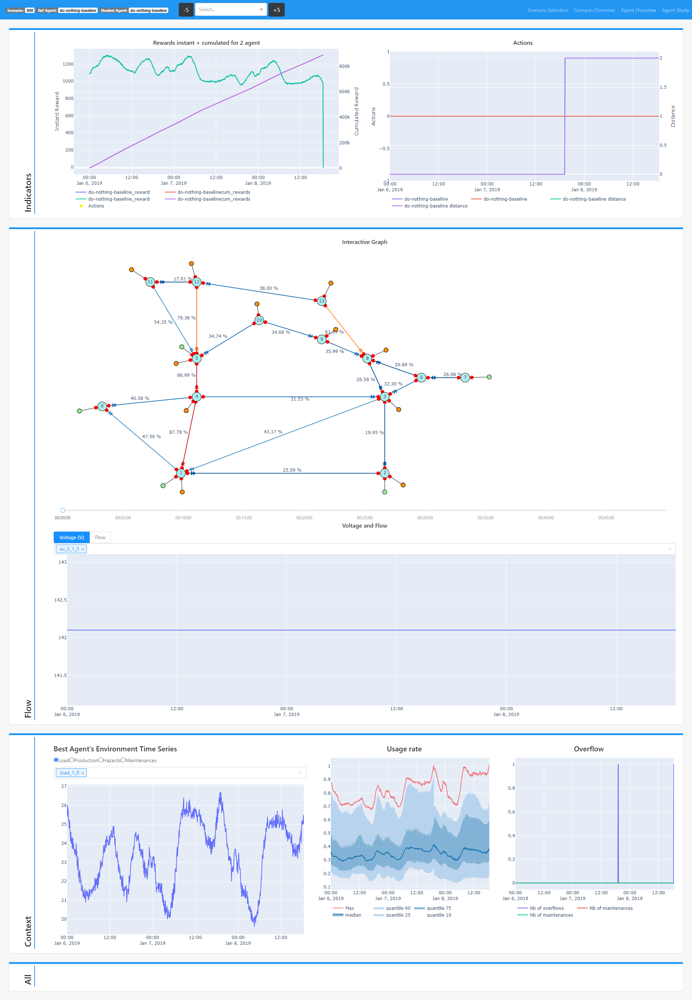

# Grid2Viz

Grid2Viz is a web application that offers several interactive views into the results of Reinforcement Learning agents that ran on the [Grid2Op](https://github.com/rte-france/Grid2Op) platform.

*   [1 Installation](#installation)
*   [2 Run the application](#run-grid2viz)
*   [3 Getting Started](#getting-started)
*   [4 Caching](#caching)

## Installation
### Requirements:
*   Python >= 3.6

#### (Optional, recommended) Step 1: Create a virtual environment
```commandline
pip3 install -U virtualenv
python3 -m virtualenv venv_grid2viz
```

#### Step 2: Install from source
```commandline
source venv_grid2viz/bin/activate
git clone https://github.com/mjothy/Grid2Viz.git
cd Grid2Viz/
pip install -U .
```

## Run Grid2Viz
```
usage: grid2viz [-h] [--agents_path AGENTS_PATH] [--env_path ENV_PATH]
                [--port PORT] [--debug]

Grid2Viz

optional arguments:
  -h, --help            show this help message and exit
  --agents_path AGENTS_PATH
                        The path where the log of the Agents experiences are
                        stored. (default to None to study the example agents
                        provided with the package)
  --env_path ENV_PATH   The path where the environment config is stored.
                        (default to None to use the provided default
                        environment)
  --port PORT           The port to serve grid2viz on. (default to 8050)
  --debug               Enable debug mode for developers. (default to False)
```

For example:

```commandline
source venv_grid2viz/bin/activate
grid2viz --port 8000
```

> **_WARNING_** Due to the caching operation the first run can take a while. All the agents present in the configuration files
will be computed and then registered in cache. Depending on your agents it could take between 5 to 15min. You can follow the progress in the console.

## Getting started

In order to use this tool, you need to have serialized the RL process of grid2op. The expected file system is :
- root_dir
    - agent_1
        - scenario_1
        - scenario_2
    - agent_2
        - scenario_1
        - scenario_2
        - scenario_3

Each of the scenario_* files have to contain all files given by serialisation of your RL through grid2op.
In order to add a new agent to the app, you will have to add the agent's folder to this root_dir
For the update process of this folder chain, see the section `Caching` (in particular, when you want to overwrite the current
agents in root_dir with new versions with the same names)

In the config.ini of this repo:
 - `agents_dir` is the path to your agents logs data directory.
 - `env_dir` is the path to the environment configuration directory. It contains a single file :
    - coords.csv : The csv file that lists the coordinates of nodes in the network

Changing this config.ini file will require a restart of the server to update.

Grid2Viz provide 2 agents with a scenario for one day and for one month available in `/grid2viz/data/agents` folder:

- do-nothing-baseline
- greedy-baseline

By default the config.ini is targeting these agents as well as the environment configuration folders.

##  Caching

The cache system allows you to only compute long calculations of the app once per agent/scenario.
The app will create a folder `_cache` in the `base_dir` of the config.ini which will contain these long calculations serialized.

If you add a new folder in your `base_dir` (either an agent, or a scenario) you will have to restart the server so the app
reads the folder tree again.

**_WARNING_** : If you overwrite the agents while they were already cached, you will have to manually reset the cache so the app
knows to compute everything again with the updated data. To do so, you just need to delete the `_cache` folder.

## Interface
#### Scenario Selection
This page display up to 15 scenarios with for each one a brief summary using the best agent's performances.


#### Scenario Overview
On this page are displayed the best agent's kpi to see his performances. It's also here that you can select an agent that will
be used as reference agent in the other pages to compare to the studied agents.


#### Agent Overview
Here's displayed your reference agent's performances. You can select an agent to study to compare it with your reference via the
dropdown on the page. The study agent selected will be used as study agent on the last page.

In the *"instant and cumulated reward"* graph you can point timestep that will be use in the next page to study
action in a specific timestep area.


#### Agent Study
The Agent Study page will display kpi of your reference agent compared to your study agent on your selected timestep area.
You will also see a summary of the previous page's kpi.



## Limitations
The app is still missing a couple features, namely a graph for visualising the flow through time, and the last line of the last screen, which will show all informations regarding the actions and observations at the selected timestep.

The Actions KPIs and the distances as well as the topological action cluster "object changed" is in alpha feature. We will need some new features from the core API to finish these features.

## Troubleshooting
### MacOS
Some mac users have been experimenting issues when lauching the app, raising the following message:

`socket.gaierror: [Errno 8] nodename nor servname provided, or not known`

The following steps might help you to overcome the issue:

1. Open your terminal
2. Type `echo $HOST` and copy the results
3. Open the file `/etc/hosts` and make sure you include: <br>
 `127.0.0.1 PASTE RESULTS FROM echo $HOST`
4. Save it and close it
5. Lauch grid2viz


